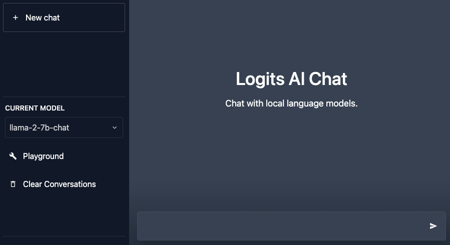

# Logits Beta

This is the home of the [Logits](https://logits.ai) public beta program.

Please use [Issues](https://github.com/LogitsAI/beta/issues) to report bugs
and use [Discussions](https://github.com/LogitsAI/beta/discussions) for any other topics
such as [Q&A](https://github.com/LogitsAI/beta/discussions/categories/q-a).

## Introduction

Logits is a fully-managed service for LLM inference and fine-tuning with a hybrid architecture
that combines the best of SaaS and self-hosting.

Like a typical SaaS, we offer high-level APIs like Chat Completion and then take full
responsibility for maintenance and upgrades of the stack that serves those requests.
However, unlike a typical SaaS, this serving stack runs entirely in your VPC on your own VMs so that
your data never leaves your control and you have full visibility into the systems that process it.

Running on your own dedicated VMs also means greater predictability for cost
(no counting tokens) and performance (no vendor-imposed rate limits), as well as control over the
lifecycle of your models (no model deprecations or silent model changes).
Fine-tuning within your VPC also has the benefit of increased network bandwidth and avoiding egress
fees when feeding data to the training process.

We achieve this combination of benefits by designing our [architecture](docs/architecture.md)
from the ground up around the unique constraints of operating our software remotely.
The parts that run in your infrastructure must adapt to an environment whose configuration we don't
control, and they must request minimal permissions since you're running code that we provide.

Meanwhile, our continuous deployment, observability, and incident management processes need to scale
to thousands of independent, single-tenant clusters to which we have only indirect access through
secure tunnels initiated from the customer's side. All of this means that once you have Logits up
and running, you can focus solely on your application while we handle ongoing operations and
feature development for the LLM platform.

## Prerequisites

* A Kubernetes cluster (v1.24 or above) running on a provider that supports [GPUs](docs/gpus.md)
  (e.g. AWS, GCP, Azure).
* A local installation of [kubectl](https://kubernetes.io/docs/tasks/tools/#kubectl) and
  [Helm](https://helm.sh/) v3 that's configured to talk to the cluster.
* A Google account (e.g. Gmail, Google Workspace) for sign-up.
  [Let us know](https://github.com/LogitsAI/beta/discussions/categories/ideas)
  if you prefer something else.

## Getting Started

If you haven't already, consult our [GPU guide](docs/gpus.md) to provision at least one Node with a
GPU in your Kubernetes cluster.

Sign into our [Accounts](https://accounts.logits.ai/) dashboard to create your account and get
your API key.

Follow the instructions there to install Logits in your cluster and access the in-cluster console:

From the in-cluster console, you can enable a model and wait for it to deploy. For the first cold
start, it will likely take a few minutes to download the container image and model weights.

Once the model is deployed, you can click the button in the Chat column to open a playground UI to
try out your local model:

You can also go back to the API tab in the console to see an example of how to make calls to the
model from your own code running in the same Kubernetes cluster:

## Pricing and Support

During the beta, we will not charge any fees for our software or services, and support will
correspondingly be best-effort unless you separately enter into an agreement with Logits AI.

Keep in mind, however, that your cloud provider will still charge for the underlying VMs and GPUs
that you provision for use with our platform.

If you encounter any problems, please post in our public [Q&A forum](https://github.com/LogitsAI/beta/discussions/categories/q-a).
If your problem depends on private details of your situation, you can alternatively email us
directly at [support@logits.ai](mailto:support@logits.ai).

If you believe you've found a bug, please [file an issue](https://github.com/LogitsAI/beta/issues).

## Roadmap

If there are features you'd like to see prioritized, please post and vote on our
[Ideas](https://github.com/LogitsAI/beta/discussions/categories/ideas) discussion board.
We will also post our own entries there to share what we're working on next.
